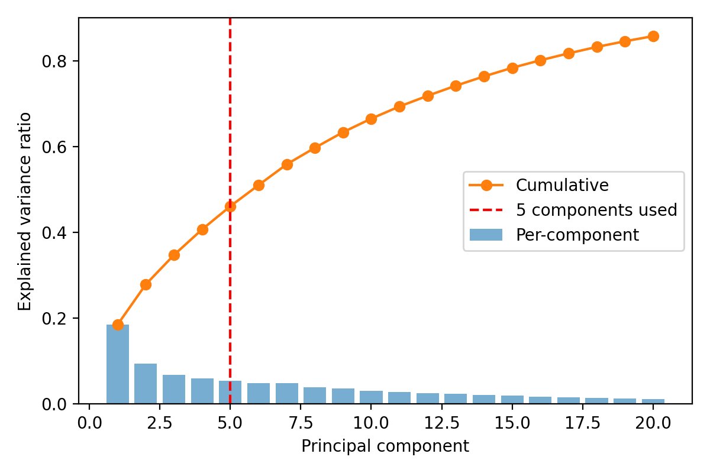
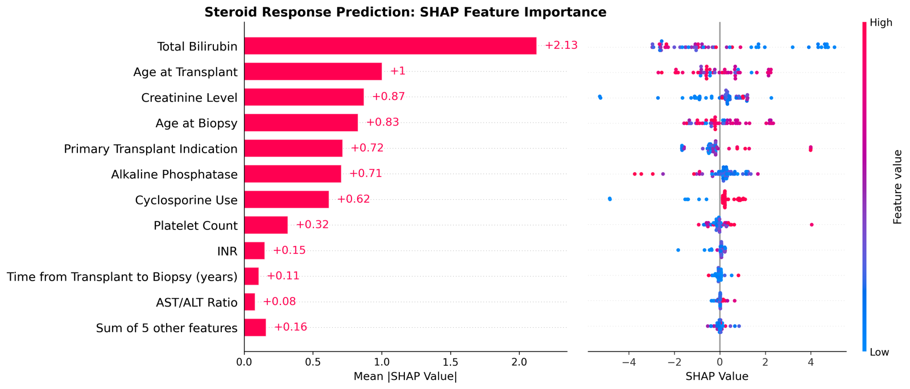

# Multimodal AI for Steroid Response Prediction in Liver-Transplant TCMR

Code accompanying a study on predicting histological steroid response in liver-transplant
recipients with T-cell mediated rejection (TCMR), integrating whole-slide pathology
(UNI-2-h embeddings) with clinical data.

## Table of Contents

- [Pipeline](#pipeline)
- [Setup](#setup)
- [Reproduce](#reproduce)
- [Results](#results)
- [Figures](#figures)
- [Model configuration](#model-configuration)
- [Data availability](#data-availability)
- [License](#license)

## Pipeline

1. Preprocess: tile whole-slide H&E images into 224x224 patches; filter to portal tract
   with a SegFormer segmentation model (keep tile when portal-pixel fraction >= 0.51).
2. Feature extraction: per-patch embeddings via the UNI-2-h pathology foundation model
   (1,536-dim).
3. Aggregation: per-patient pooling (min+max+mean) of patch embeddings.
4. Evaluation: patient-level stratified 5-fold cross-validation. StandardScaler and PCA
   are fit on training folds only. Hyperparameters tuned with GridSearchCV (inner CV).
5. Statistics: predictions pooled across out-of-fold patients (each patient predicted
   exactly once), then 95% CIs by patient bootstrap and pairwise DeLong tests.

## Setup

```bash
uv sync --extra test                 # create the environment from pyproject.toml
cp config.example.yaml config.yaml   # then edit paths to your local data
```

## Reproduce

```bash
uv run python -m src.run_analysis    # pooled-OOF CIs (results.csv) + DeLong matrix
uv run python -m src.evaluation      # KFold + LOPO + label-permutation control
uv run python -m src.robustness      # patch-count / order / color-baseline checks
uv run python -m src.supplementary   # PCA scree, hyperparameter grid, variable encoding
uv run python -m src.baseline_severity  # baseline-severity confound + inter-biopsy interval
uv run python -m src.figures         # AUROC forest plot, scree, clinical importance
uv run --extra test python -m pytest tests -v   # unit tests
```

Outputs are written to the `output_dir` set in `config.yaml`.

## Results

Patient-level pooled out-of-fold performance (n = 55 patients, each predicted once),
95% CIs by patient bootstrap. Best estimator shown per modality family; the full
matrix is written to `results.csv`.

| Modality              | AUROC (95% CI)     | Sensitivity (95% CI) | Specificity (95% CI) |
|-----------------------|--------------------|----------------------|----------------------|
| Clinical (RF)         | 0.51 (0.35, 0.66)  | 0.37 (0.19, 0.56)    | 0.64 (0.46, 0.81)    |
| Pathology (RF)        | 0.81 (0.69, 0.91)  | 0.56 (0.36, 0.74)    | 0.89 (0.77, 1.00)    |
| Early fusion (RF)     | 0.85 (0.74, 0.93)  | 0.52 (0.33, 0.72)    | 0.89 (0.77, 1.00)    |
| Late fusion (RF + RF) | 0.80 (0.67, 0.91)  | 0.52 (0.33, 0.71)    | 0.93 (0.82, 1.00)    |

Permutation and leave-one-patient-out controls (`src/evaluation.py`) confirm the pathology
signal is label-driven, not leakage: real-label LOPO AUROC stays high (RF 0.92, SVM 0.91)
while label-permuted AUROC collapses to chance (RF 0.50, SVM 0.49).

## Figures

PCA scree of the pooled per-patient pathology embeddings (the first 5 components, used
downstream, capture 46% of variance):



Clinical feature contributions (SHAP summary from the clinical model):



Both panels are regenerated from your own inputs by `src/figures.py` (the scree directly;
a model-agnostic permutation-importance variant of the clinical ranking). No patient images
or per-patient rows are shipped with this repository.

## Model configuration

Hyperparameters are tuned per fold by `GridSearchCV` (3-fold inner CV, `roc_auc`):

| Model | Search space                                                         | Combinations |
|-------|----------------------------------------------------------------------|--------------|
| LR    | C [0.01, 0.1, 1, 10]; penalty [l1, l2]; solver liblinear             | 8            |
| SVM   | C [0.1, 1, 10]; kernel [rbf, linear]; gamma [scale, auto]            | 12           |
| RF    | n_estimators [50, 100, 200]; max_depth [3, 4, 5, None]; criterion [gini, entropy] | 24 |
| GB    | learning_rate [0.1, 0.2, 0.3]; n_estimators [100, 200, 300]; max_depth [3, 4, 5] | 27 |

## Data availability

Whole-slide images and clinical records contain protected health information and cannot
be shared publicly. De-identified per-patient feature embeddings are available from the
corresponding author on reasonable request, subject to an institutional data-sharing
agreement. See `data/README.md` for the expected input schema.

## License

Apache-2.0. See `LICENSE`.
